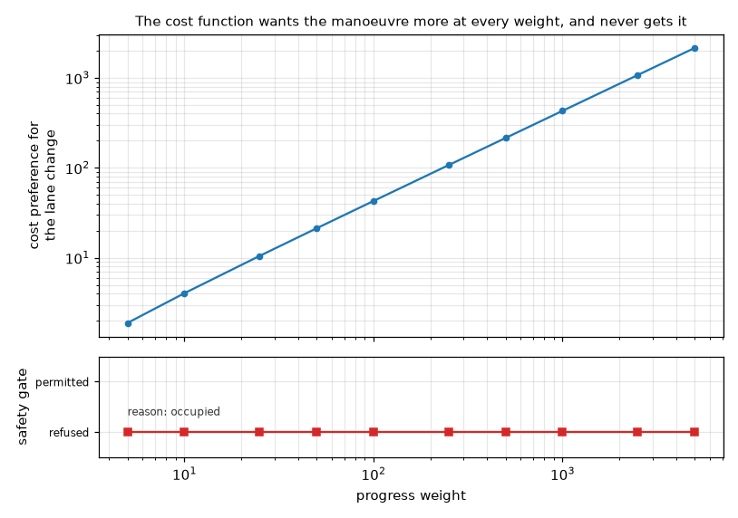
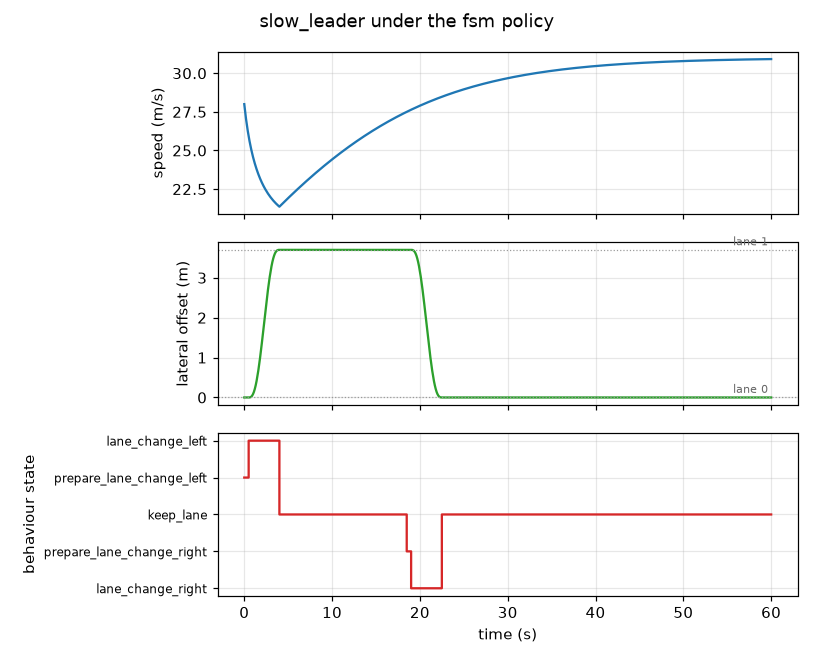
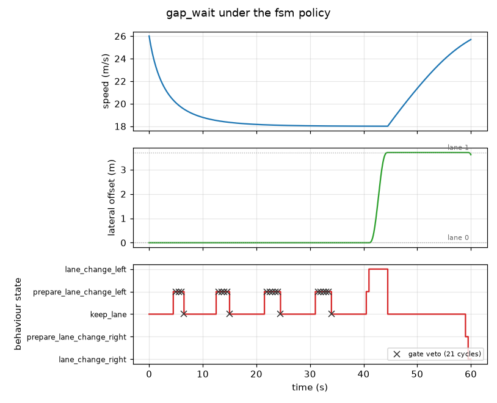

# behavior-planner-fsm

Lane change decisions from a finite state machine and a cost function, on a highway
traffic simulation in which the surrounding vehicles follow the Intelligent Driver Model
and choose their own lanes with MOBIL.

[](https://github.com/Eelis03/behavior-planner-fsm/actions/workflows/ci.yml)
[](https://www.python.org/downloads/)
[](LICENSE)



## The safety gate is not a cost term

A weighted cost function computes `w1 * c1 + w2 * c2 + ...`, and every term in that sum is
negotiable by construction. If safety appears as `w_safety * c_safety`, then for any finite
`w_safety` there is a progress advantage large enough to outweigh it. That is not a tuning
error to be avoided by choosing `w_safety` carefully. It is what addition means, and the
situations in which the progress advantage is largest, a slow obstruction ahead and a fast
lane beside it, are exactly the situations in which the trade must not be available.

So safety is not a term here. It is a separate object, `GapAndDecelerationGate`, with its
own thresholds in its own dataclass, which returns a named verdict rather than a number and
is applied before any cost is compared. The claim is that this changes the behaviour of the
planner in a way no weight can reproduce. `examples/run_gate_experiment.py` is the
experiment that tests it.

The scene is fixed. The ego does 18 m/s behind a leader whose centre is 25 m ahead doing
15 m/s, so the progress term prefers the lane to its left. That lane is occupied: a vehicle
sits 1.5 m behind the ego, well inside its 5 m body length, in the space the manoeuvre would
move into. The soft safety weight is set to zero, which is the misconfiguration a separate
gate exists to survive. Only the progress weight moves, from its default of 5 to a thousand
times that.

| Progress weight | Keep lane cost | Lane change cost | Cost prefers | Gate | Planner takes it |
| --------------- | -------------- | ---------------- | ------------ | ---- | ---------------- |
| 5               | 2.1505         | 0.2650           | the change   | refused, `occupied` | no |
| 50              | 21.5054        | 0.2650           | the change   | refused, `occupied` | no |
| 500             | 215.0538       | 0.2650           | the change   | refused, `occupied` | no |
| 5000            | 2150.5376      | 0.2650           | the change   | refused, `occupied` | no |

Ten weights are swept, of which four are shown. At every one of them the cost function ranks
the lane change first, at every one of them the gate refuses it, and at none of them does the
planner take it. The cost preference for the manoeuvre grows by a factor of 1140 across the
sweep, which is the figure above: a straight line on log axes over the verdict that does not
move. A cost term could not produce that plot. Somewhere along the horizontal axis it would
have to cross.

The soft safety term in the cost function is not redundant with the gate, and the difference
is measurable rather than asserted. Run the same sweep with `--safety-weight 1.5` and the
lane change costs 1.7650 instead of 0.2650, which is enough to change which permitted
candidate the planner picks at the default progress weight. Not one verdict moves.
`tests/test_gate_experiment.py` asserts both halves of that. The cost term makes the planner
polite. The gate makes it safe. Only one of the two is load bearing.

## The state machine

Five states, over keeping lane, preparing a change left or right, and executing a change
left or right; six events; thirty pairs. `algorithm/fsm.py` declares the legal pairs in
`TRANSITIONS` and the illegal pairs in `REJECTED`, and a check that runs at import refuses
to load the module unless the two are disjoint and their union is the whole product. A pair
that is neither declared legal nor declared illegal is an error the moment the module loads,
not a surprise in a scenario nobody ran.

An illegal pair raises `IllegalTransitionError`. It does not return the current state. The
silent version produces a vehicle that quietly does nothing, which is indistinguishable from
a vehicle that has correctly decided to do nothing, and that is a bug which survives review.

The two prepare states are not decoration. A vehicle that wants a gap in the next lane has
to adjust its longitudinal behaviour first, and the prepare state is where that adjustment
lives: in `PREPARE_LANE_CHANGE_LEFT` the ego follows the more restrictive of its own leader
and the target lane's leader, so it drops back rather than driving past the gap it wants.
The cost function scores a prepare state on the mean of the lane it is aiming at and the lane
it is still in, which is what stops the machine from parking in a prepare state and
collecting the target lane's benefit without paying for the manoeuvre.

Around the machine, four layers, each importing only from the ones above it.

| Layer | What is in it |
| --- | --- |
| `model/` | Pure data: road geometry, vehicle and lane change, the two state alphabets, every tunable number, the traffic snapshot, the decision records. No input or output, and no knowledge of planners. |
| `algorithm/` | The five Protocols, the Intelligent Driver Model, MOBIL, the transition table, the weighted cost, the safety gate, the trajectory generator. Draws nothing and writes nothing. |
| `pipeline/` | The scenarios, the density sweep grid, the synchronous simulator, the run trace, the gate experiment, and the one module where concrete implementations are chosen. |
| `analysis/` | Metrics, Markdown tables and the three figures. Reads what the pipeline produced and nothing else. |

Substituting `KeepLaneBaseline()` for the default policy, or a different cost model or gate,
is a change to `pipeline/suite.py` and to nothing else.

## Results

Produced on Python 3.12.10 with numpy 2.5.1 and matplotlib 3.11.1, on one core of an AMD64
desktop under Windows 11. Every run uses a 1200 metre three lane ring at an integration step
of 0.1 seconds. The behaviour layer plans at 2 Hz, the traffic consults MOBIL at 1 Hz, and a
lane change takes 3.5 seconds.

### Seven scripted scenarios

From `uv run python examples/run_suite.py`, which takes about 2.6 seconds.

| Scenario         | Collisions | Mean speed (m/s) | Distance (m) | Lane changes | Min headway (s) | Min TTC (s) | TTC p05 (s) | TTC median (s) |
| ---------------- | ---------- | ---------------- | ------------ | ------------ | --------------- | ----------- | ----------- | -------------- |
| free_flow        | 0          | 28.43            | 1707         | 0            | inf             | inf         | inf         | inf            |
| slow_leader      | 0          | 28.34            | 1700         | 2            | 1.96            | 6.88        | 7.36        | 12.24          |
| blocked_overtake | 0          | 20.30            | 1217         | 0            | 1.87            | 6.88        | 10.69       | 211.40         |
| gap_wait         | 0          | 19.67            | 1179         | 1            | 1.82            | 8.12        | 12.86       | 259.42         |
| light_traffic    | 0          | 25.01            | 1501         | 1            | 2.75            | 30.47       | 30.59       | 38.19          |
| dense_traffic    | 0          | 20.33            | 1220         | 1            | 1.87            | 27.31       | 27.76       | 38.35          |
| slow_right_lane  | 0          | 26.27            | 1577         | 3            | 3.18            | 13.09       | 13.29       | 14.84          |

Against a control policy identical in every respect except that it never leaves its lane:

| Scenario         | Planner speed (m/s) | Baseline speed (m/s) | Gain (percent) | Lane changes |
| ---------------- | ------------------- | -------------------- | -------------- | ------------ |
| free_flow        | 28.43               | 28.43                | +0.0           | 0            |
| slow_leader      | 28.34               | 20.30                | +39.6          | 2            |
| blocked_overtake | 20.30               | 20.30                | +0.0           | 0            |
| gap_wait         | 19.67               | 18.54                | +6.1           | 1            |
| light_traffic    | 25.01               | 24.25                | +3.1           | 1            |
| dense_traffic    | 20.33               | 20.03                | +1.5           | 1            |
| slow_right_lane  | 26.27               | 18.39                | +42.9          | 3            |

Over the seven: 0 collisions, 8 lane changes, a mean ego speed of 24.05 m/s, a smallest time
headway of 1.82 s and a smallest time to collision of 6.88 s. The gate raised three distinct
veto reasons, `follower_gap`, `follower_time_to_collision` and `follower_deceleration`.

A veto reason says which manoeuvres the gate stopped and nothing about how close the ones it
allowed came to being stopped, so the verdict carries a margin as well: the distance from
whichever threshold bound the manoeuvre, as a fraction of that threshold. The tightest one
over the seven is 0.327, on the change `gap_wait` eventually takes. Thirty seven planning
cycles across the suite carry a bounded margin; the rest either adopted no manoeuvre or
adopted one into a lane empty enough that no threshold bound it. The reasons and the margin
are the same measurement seen from either side, and a gate that refused nothing because
nothing came close is not the same object as one that permitted everything by a hair.

The benefit is where the opportunity is. The two scenarios with a clear lane beside a slow
obstruction gain 39.6 and 42.9 percent, most of the way to the free flow speed of 28.43 m/s.
The two with no usable gap gain nothing: `free_flow` has nothing to overtake and
`blocked_overtake` has nowhere to go. A planner that gained speed in `blocked_overtake`
would be taking gaps it should not have.



That is the whole decision sequence of `slow_leader` on one time axis: the approach that
takes the ego down to 21.36 m/s, the prepare state, the crossing that finishes at 4.0
seconds, the recovery towards its 31 m/s free flow speed while passing, and the return to
lane 0 at 22.5 seconds once the obstruction is behind. No column of the table above contains
it.

### Waiting has a price, and the gate makes the planner pay it



`gap_wait` is the same three panels and the opposite outcome. The ego sits behind a leader
doing 18 m/s while faster traffic streams past on its left. It enters the prepare state at
4.5, 12.5, 21.5 and 31.0 seconds and abandons the attempt each time on `follower_gap`, at
6.5, 15.0, 24.5 and 34.0 seconds. A usable gap arrives at 41.0 seconds, the change commits,
and it completes at 44.5. Twenty one planning cycles carry a veto in total. The 6.1 percent
gain in the table is the value of one lane change taken 36.5 seconds after the cost function
first asked for it. `uv run python examples/run_scenario.py --scenario gap_wait
--transitions-only` prints that sequence as text.

### Forty randomly filled runs, which say something the seven do not

Seven scenarios each run once at one seed demonstrate the behaviours. They do not
characterise the planner, and until recently this repository listed that gap as a known
limitation. `uv run python examples/run_sweep.py` closes it: five densities, eight seeds
each, both policies, 80 runs in about 30 seconds. Only the density and the seed vary.

| Vehicles per lane | Runs | Collisions | Speed p05 (m/s) | Speed median (m/s) | Speed p95 (m/s) | Median gain (percent) | Mean gain (percent) | Lane changes |
| ----------------- | ---- | ---------- | --------------- | ------------------ | --------------- | --------------------- | ------------------- | ------------ |
| 4                 | 8    | 0          | 25.45           | 26.88              | 27.98           | +0.0                  | +0.5                | 2            |
| 8                 | 8    | 0          | 21.54           | 23.99              | 25.70           | +0.0                  | -0.7                | 7            |
| 12                | 8    | 0          | 21.20           | 22.79              | 23.98           | +0.0                  | +2.7                | 7            |
| 16                | 8    | 0          | 16.76           | 20.65              | 21.87           | +0.0                  | -4.7                | 9            |
| 20                | 8    | 0          | 12.53           | 19.65              | 22.25           | +0.0                  | -8.9                | 7            |

Three things come out of it, and two of them are unflattering.

The required result holds. Zero collisions involving the ego across all 40 planner runs and
all 40 control runs. One overlap occurred anywhere in the 80: two traffic vehicles, not the
ego, at 20 vehicles per lane under the control policy. The trace separates the two counts, so
a collision between two traffic vehicles cannot be reported as a planner success or hide
behind one.

The speed benefit does not generalise. The median paired gain is +0.0 percent at every
density, because in most random fills the planner finds no gap worth taking and behaves
exactly like the control. The mean is positive at 4 and 12 vehicles per lane and negative at
8, 16 and 20, reaching -8.9 percent at the highest density. The sweep names its worst run:
`density_20_seed_102`, at -47.8 percent against the control on the same seed, where the ego
averaged 11.07 m/s after two lane changes and two abandoned ones. The lowest ego speed
anywhere in the planner runs is 0.00 m/s and the lowest under the control is 8.09 m/s, so
that density is congested for both policies and only the planner came to a stop. This is the
memoryless progress term behaving exactly as `docs/design-notes.md` predicts it must: it
measures an instantaneous speed shortfall over a 120 m horizon and cannot tell a lane change
worth 2 m/s for ten seconds from one worth 2 m/s for two.

The margins are thinner than the scripted suite suggests. The smallest time headway over the
40 planner runs is 0.72 s against 1.82 s over the seven scenarios, and the smallest time to
collision is 0.75 s against 6.88 s. Those are the ego following its leader under the car
following model rather than the gate permitting anything: the gate governs lane changes and
has no authority over how closely the ego follows in its own lane. The number is still
evidence that the seven hand built scenarios sample an easier part of the space than random
traffic does.

The gate's own margin moves the same way and further. The tightest one anywhere in the 40
planner runs is -0.436, against +0.327 over the seven scenarios, and a negative margin means
what the abort path says it means: a lane change already past 40 percent of its lateral
transition was finished rather than reversed after the gate came to object to it. Four runs
contain such a cycle, `density_16_seed_108`, `density_20_seed_102`, `density_20_seed_103`
and `density_20_seed_105`, all of them at the two highest densities. None of them ends in a
collision, which is the point: the abort limit is a policy about which of two bad options to
take, and until this number existed the repository could not say how often it was being
exercised. The scripted suite exercises it never, and
`tests/test_gate_margin.py::test_the_suite_takes_no_manoeuvre_the_gate_had_come_to_refuse`
is the assertion of that, scoped to the suite because the sweep does not support it.

## Installation

Requires Python 3.12 or later. Continuous integration runs the whole suite on 3.12 and
3.13, on Linux and on Windows, so the version floor in `pyproject.toml` is a tested claim
rather than a declared one.

```bash
git clone https://github.com/Eelis03/behavior-planner-fsm.git
cd behavior-planner-fsm
uv sync --all-extras --dev
```

Using pip instead of uv:

```bash
python -m venv .venv
.venv/bin/activate      # Windows: .venv\Scripts\activate
pip install -e ".[dev]"
```

The package ships `py.typed`, so a project that installs it gets the annotations rather than
`Any`.

```python
from behavior_planner import Road, Scenario, VehicleSpec, run_scenario, scenario_metrics

scenario = Scenario(
    name="overtake",
    description="One slow vehicle ahead in the right lane.",
    road=Road(lane_count=3, length=1200.0),
    ego=VehicleSpec(lane=0, s=0.0, speed=28.0, desired_speed=31.0),
    duration=30.0,
    scripted=(VehicleSpec(lane=0, s=60.0, speed=20.0, desired_speed=20.0, holds_lane=True),),
)

trace = run_scenario(scenario)
metrics = scenario_metrics(trace)
print(metrics.collisions, metrics.lane_changes, round(metrics.mean_speed, 2))
# 0 2 26.13
print([state.value for state in trace.state_sequence])
# ['prepare_lane_change_left', 'lane_change_left', 'keep_lane',
#  'prepare_lane_change_right', 'lane_change_right', 'keep_lane']
```

## Reproducing every number here

Four scripts, each printing the numbers quoted above.

```bash
uv run python examples/run_gate_experiment.py                            # the opening claim
uv run python examples/run_suite.py                                      # the two scenario tables
uv run python examples/run_scenario.py --scenario gap_wait --transitions-only
uv run python examples/run_sweep.py                                      # the density sweep
```

`run_scenario.py` accepts any of the seven scenario names and prints that run's decision
timeline and its metrics, including the minimum speed quoted for `slow_leader` above.

One command regenerates all three figures in place:

```bash
uv run python examples/plot_results.py --output docs/figures
```

The files under `docs/figures/` are snapshots, tracked so the README renders without a build
step. CI does not compare them byte for byte, because matplotlib output is not byte
reproducible across platforms, font sets or backend versions, and a check that failed on a
font substitution would say nothing about the planner. What CI does check is that the command
above still writes exactly those three files, that each is a valid PNG, and that the tracked
set stays inside its 250 kB budget; the three currently total 141 kB at 110 dots per inch.

Tests, lint and types:

```bash
uv run pytest -q
uv run ruff check .
uv run ruff format --check .
uv run mypy
```

Coverage, measured with the command CI runs:

```bash
uv run pytest --cov=src/behavior_planner --cov-report=term-missing
```

That reports 97 percent of 1761 statements. CI enforces `--cov-fail-under=95`, which is the
measured figure rounded down and reduced by two, so a small refactor does not fail the build
and a whole module arriving without tests does. What is left uncovered is validation branches
in the configuration dataclasses and two defensive paths in the planner that the state
machine makes unreachable.

The suite is 390 tests in about 16 seconds, in three tiers. Property and invariant tests
cover the mathematics: all thirty state and event pairs individually, the car following
model against its closed form equilibrium gap and free flow speed from either side, the
quintic against its closed form peak derivatives, the margin the gate reports beside each
verdict, and the gate experiment above. Regression tests compare a fresh run of the
seven scenarios against `tests/data/reference_run.json`, pinning counts, veto
classifications and the behaviour state sequence exactly and continuous aggregates at a
relative tolerance of `1e-6`; a test asserts the smallest gap between the best two
admissible candidates anywhere in the suite, which is what keeps the exact pins honest.
Integration tests run every script in `examples/` as a subprocess under a reduced workload,
discovering each script's options from its own help so a new example is covered the moment
it is added.

## What this does not do

`docs/design-notes.md` records the alternatives considered and rejected, and the conditions
under which this planner gives poor results. The short version: the cost weights sit in a
narrow window and a hand tuned linear cost function cannot be widened out of it; the traffic
prediction is a constant speed extrapolation, so a neighbour that brakes hard during the
ego's 3.5 second manoeuvre is not anticipated; the road is a straight ring with no lane
topology; collisions are counted rather than prevented by construction; and there is no
perception, localisation or tracking controller, so every gap the gate enforces carries no
allowance for measurement error.

The same document records what was closed and what it cost. The evaluation limitation, seven
scenarios at one seed each, is the entry that went: the sweep above replaced it, at the price
of 30 seconds of runtime and a result that is less flattering than the one it replaced.

## References

Models:

- M. Treiber, A. Hennecke and D. Helbing, "Congested traffic states in empirical
  observations and microscopic simulations", Physical Review E 62(2), 2000, pages 1805 to
  1824. DOI [10.1103/PhysRevE.62.1805](https://doi.org/10.1103/PhysRevE.62.1805). The
  Intelligent Driver Model and the highway parameter set used for the defaults.
- A. Kesting, M. Treiber and D. Helbing, "General lane-changing model MOBIL for
  car-following models", Transportation Research Record 1999(1), 2007, pages 86 to 94.
  DOI [10.3141/1999-10](https://doi.org/10.3141/1999-10). The lane change model that
  drives the traffic, its safety criterion, its politeness factor and its asymmetric
  keep-right variant.
- M. Werling, J. Ziegler, S. Kammel and S. Thrun, "Optimal trajectory generation for
  dynamic street scenarios in a Frenet frame", IEEE International Conference on Robotics
  and Automation, 2010, pages 987 to 993.
  DOI [10.1109/ROBOT.2010.5509799](https://doi.org/10.1109/ROBOT.2010.5509799). The
  Frenet frame formulation and the quintic lateral polynomial.
- M. Treiber and A. Kesting, "Traffic Flow Dynamics: Data, Models and Simulation",
  Springer, 2013.
  DOI [10.1007/978-3-642-32460-4](https://doi.org/10.1007/978-3-642-32460-4). The
  reference treatment of both models, including the equilibrium relations used in the
  tests and the stop and go regime the densest sweep runs sit in.
- J. Wei, J. M. Snider, T. Gu, J. M. Dolan and B. Litkouhi, "A behavioral planning
  framework for autonomous driving", IEEE Intelligent Vehicles Symposium, 2014, pages 458
  to 464. DOI [10.1109/IVS.2014.6856582](https://doi.org/10.1109/IVS.2014.6856582). The
  cost-based behaviour layer this planner follows in structure.
- J. Ziegler and C. Stiller, "Spatiotemporal state lattices for fast trajectory planning
  in dynamic on-road driving scenarios", IEEE/RSJ International Conference on Intelligent
  Robots and Systems, 2009, pages 1879 to 1884.
  DOI [10.1109/IROS.2009.5354448](https://doi.org/10.1109/IROS.2009.5354448). The lattice
  alternative to a behaviour state machine, considered and rejected in the design notes.
- P. Bender, J. Ziegler and C. Stiller, "Lanelets: efficient map representation for
  autonomous driving", IEEE Intelligent Vehicles Symposium, 2014, pages 420 to 425.
  DOI [10.1109/IVS.2014.6856487](https://doi.org/10.1109/IVS.2014.6856487). The lane
  topology representation a curved or branching road would require, noted as a limitation.

Dependencies:

- [numpy](https://numpy.org/) (BSD 3-Clause). The seeded PCG64 generator that places the
  random traffic, and the percentile and mean reductions in the analysis layer. The
  simulation loop itself uses plain Python floats, which is deliberate: it removes the
  reduction order of a linear algebra kernel from the set of things a run can depend on.
- [matplotlib](https://matplotlib.org/) (matplotlib license, a BSD-style permissive
  license). The three figures.
- [pytest](https://docs.pytest.org/) (MIT), [pytest-cov](https://pytest-cov.readthedocs.io/)
  (MIT), [ruff](https://docs.astral.sh/ruff/) (MIT), and [mypy](https://mypy-lang.org/)
  (MIT). Development only: test running, coverage, linting, and type checking.

## License

Released under the MIT license. See [LICENSE](LICENSE).
